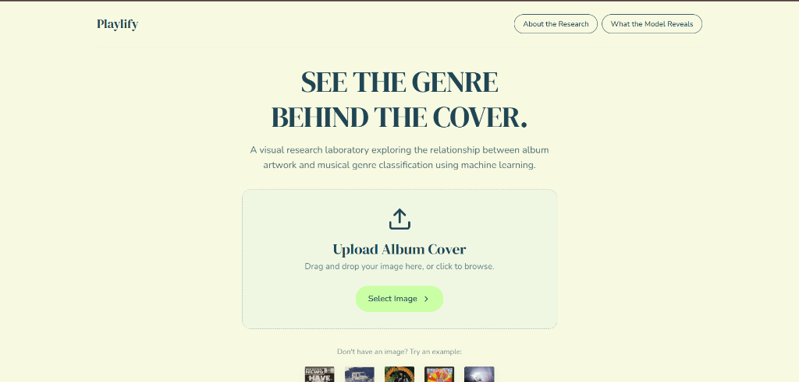
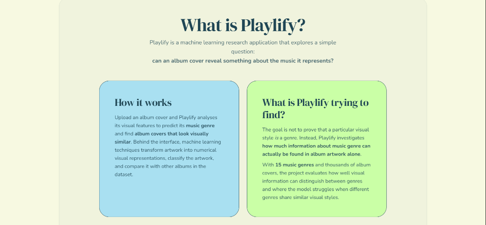
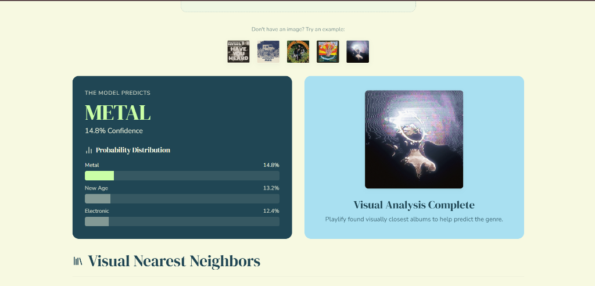
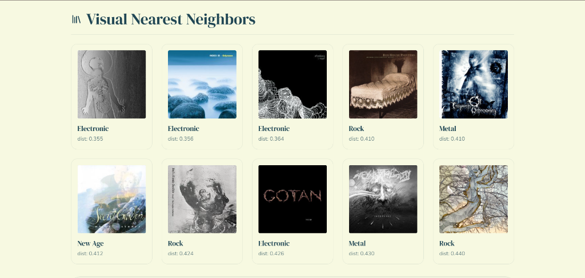
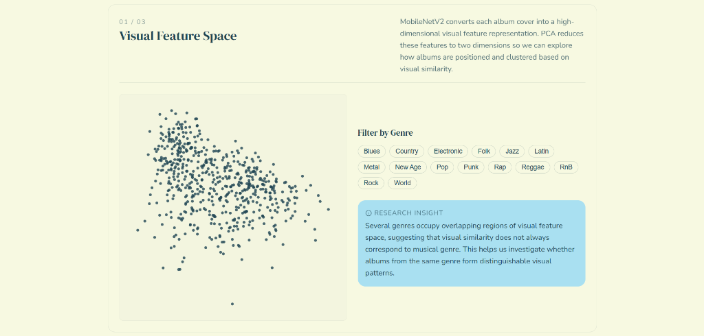

# Playlify

**Playlify** is an interactive visual research laboratory exploring the relationship between album cover artwork and musical genre classification using Machine Learning.

## Research Question
*Can we predict the musical genre of an album based purely on its cover artwork?*

This project explores deep feature extraction, clustering, and classification techniques. It combines an offline machine learning research pipeline with a responsive web application that allows users to upload any album cover image, predict its musical genre, discover visually similar albums, and explore the underlying feature representations.

---

## Key Features & Interactive Application

- **Genre Prediction**: Upload any album cover artwork to predict its musical genre using a fine-tuned MobileNetV2 neural network.
- **Visual Similarity Search**: Computes high-dimensional feature embeddings and retrieves the top nearest-neighbor album covers based on cosine distance.
- **Visual Feature Space Explorer**: An interactive 2D PCA scatter plot visualizing how 16,500+ album covers cluster in feature space.
- **Confusion Matrix Explorer**: Interactive matrix breakdown highlighting where the classification model succeeds and where genres visually overlap.
- **Genre Visual DNA**: Comparative analysis of mean color distributions, brightness, and contrast across 15 distinct genres.

---

## Application Interface

| Landing & Upload Interface | About & Research Overview |
| :---: | :---: |
|  |  |

| Genre Prediction & Probability Distribution | Nearest Neighbors Visual Similarity |
| :---: | :---: |
|  |  |

### Interactive Feature Space Explorer


---

## Research Observations & Key Insights

1. **Visual DNA of Genres**:
   - **Metal & Rap**: Album covers exhibit significantly lower average brightness (Metal average = **105.9 / 255**) and high visual contrast.
   - **Latin, Reggae & Pop**: Show the highest mean brightness (**143.8 – 144.7**) with vibrant, warm color channel averages.
2. **Genre Confusion & Visual Overlap**:
   - The model achieves **33.19% Top-1 Accuracy** across 15 genres (*~5x better than a random baseline of 6.67%*).
   - High confusion occurs between visually adjacent genres (e.g., **Rock vs. Metal** or **Electronic vs. Pop**), demonstrating where visual signals alone are insufficient for single-label categorization.
3. **Similarity Search vs. Hard Classification**:
   - Nearest-neighbor visual similarity search produces aesthetic clusters that are often more intuitive to users than strict genre labels.

---

## Technology Stack

- **Frontend:** React 19, Vite, TypeScript, Vanilla CSS
- **Backend:** Python, FastAPI, Uvicorn
- **Machine Learning & Pipeline:** PyTorch, MobileNetV2, scikit-learn, OpenCV / Pillow, Pandas, NumPy

---

## Repository Structure

- `backend/` - Production FastAPI service handling image inference and serving predictions.
- `frontend/` - React application providing the interactive user interface and visualizations.
- `research/` - Offline scripts for data cleaning, EDA, feature extraction, PCA, model training, and evaluation.

---

## Local Setup

### Backend (Local Development)
1. Navigate to the `backend/` directory.
2. Install dependencies:
   ```bash
   pip install -r requirements.txt
   ```
3. Run the development server:
   ```bash
   uvicorn main:app --reload
   ```

### Frontend (Local Development)
1. Navigate to the `frontend/` directory.
2. Install dependencies:
   ```bash
   npm install
   ```
3. Set your environment variables in `.env` (see [DEPLOYMENT.md](./DEPLOYMENT.md) for details):
   ```
   VITE_API_URL=http://localhost:8000
   ```
4. Start the Vite development server:
   ```bash
   npm run dev
   ```

---

## Deployment
For detailed deployment instructions for both frontend and backend environments, please refer to [DEPLOYMENT.md](./DEPLOYMENT.md).

---

## Reference Citation

> Oramas, S., Barbieri, F., Nieto, O., & Serra, X. (2018). Multimodal Deep Learning for Music Genre Classification. *Transactions of the International Society for Music Information Retrieval*, 1(1). DOI: [10.5334/tismir.10](https://doi.org/10.5334/tismir.10)
